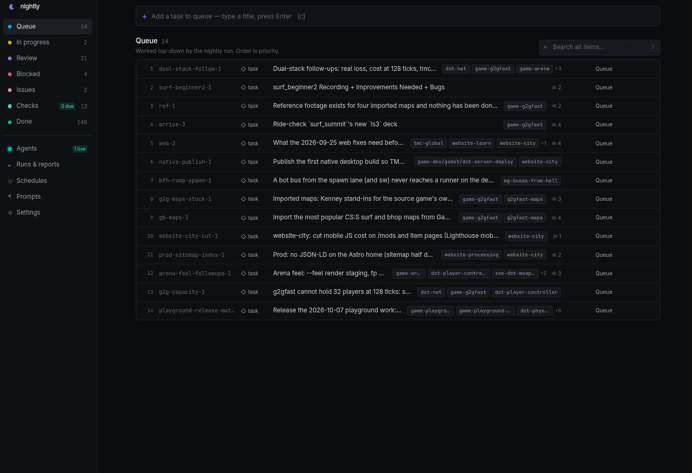
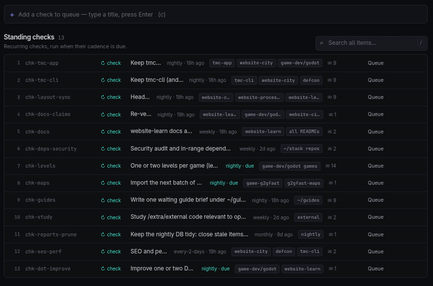
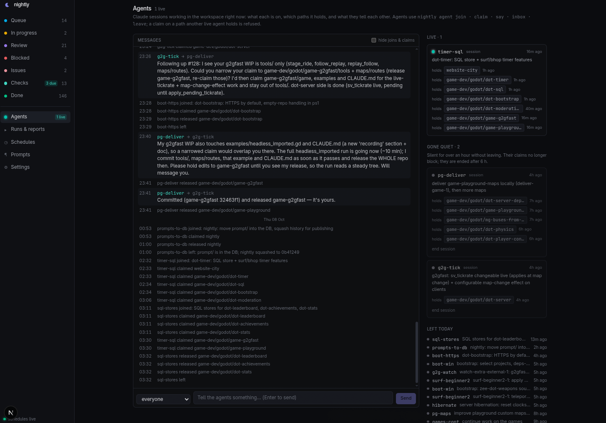
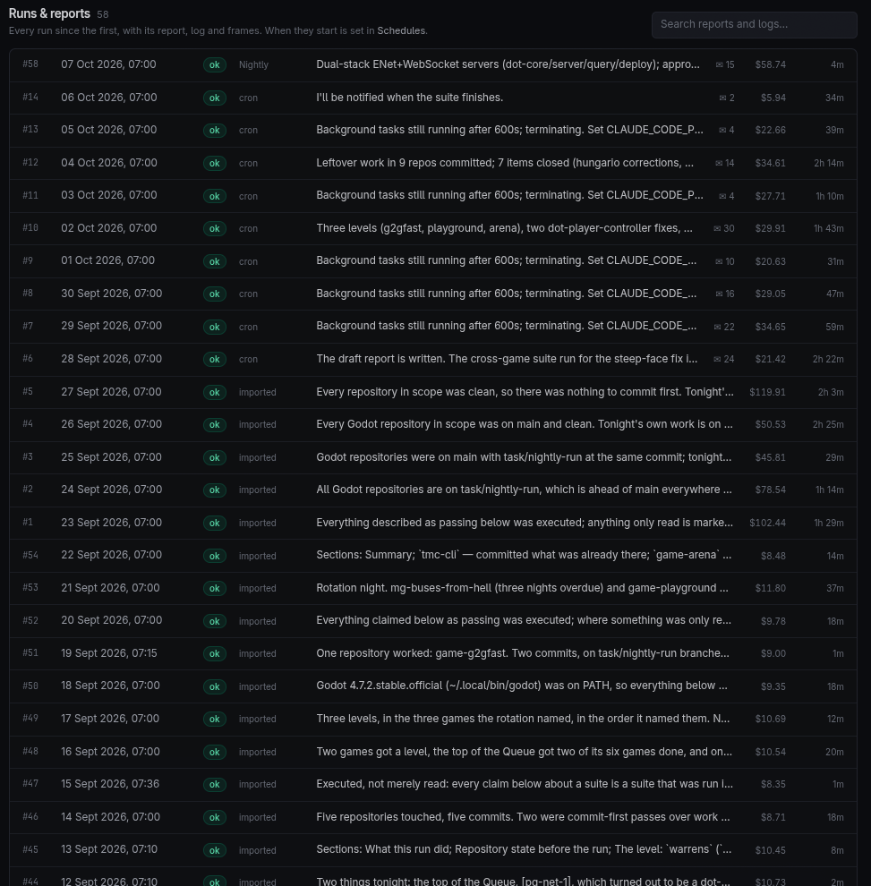
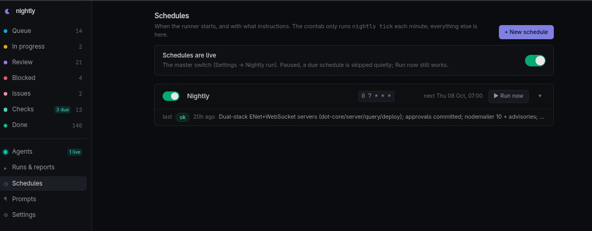
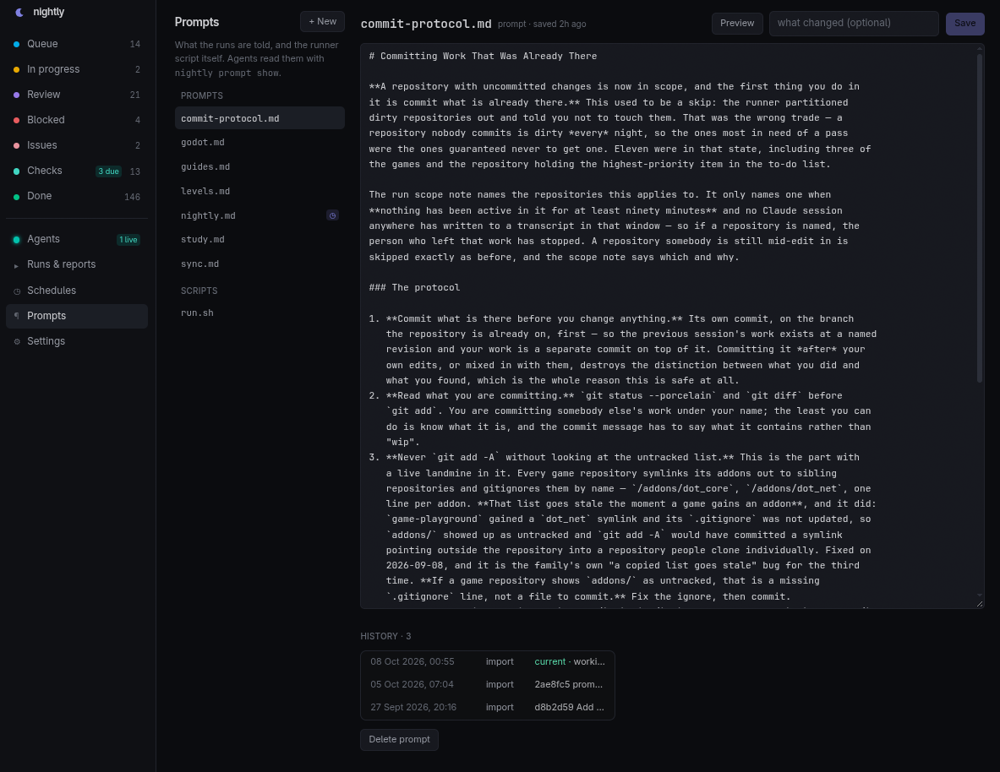
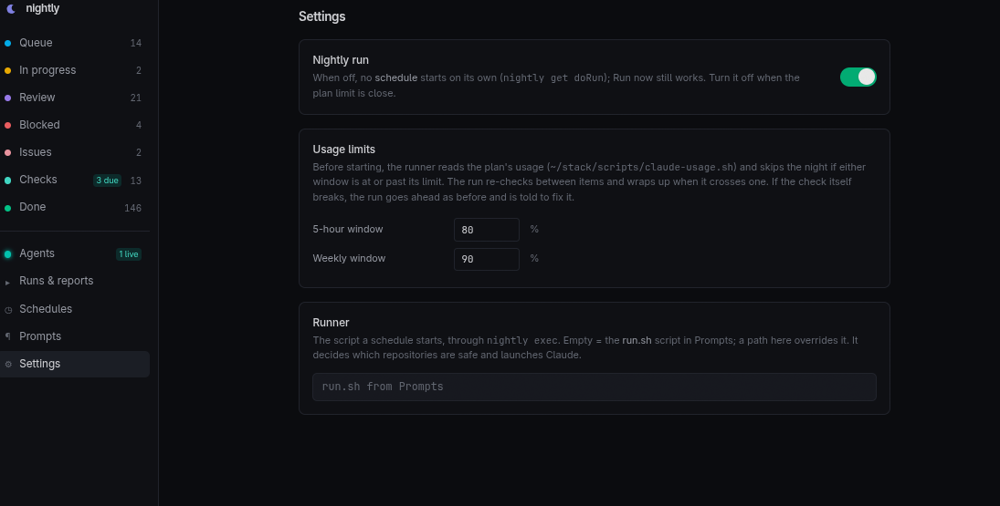

This started out as a small project I had [Claude Code](https://claude.com/product/claude-code) create for my internal development with my gaming and modding project, [TMC](https://moddingcommunity.com).

Initially, one simple cron job ran *every night* to manage tasks and track the progress of Claude Code agents and workers. Over time, I've been adding more and more features to the project. Given these additions, I've been impressed with how much functionality has been getting integrated into the project and I decided I'd make it open source so that others can benefit from it if they want to use it for their development.



<details>
<summary>More Previews</summary>








</details>

Stack: Next.js 16 (App Router) · tRPC v11 · Prisma 7 (SQLite via `@prisma/adapter-better-sqlite3`) · Tailwind v4 · React 19. The CLI is plain Node ESM on `node:sqlite`.

## Features
- Schedule **one or more** runs using the web panel's Cron settings.
- Manage **tasks** and track the **progress** of Claude Code agents and workers automatically.
- A **Live** section for **concurrent agents** to communicate to each other in real-time to prevent **overlapping work** and ensure coordination.
- When a worker is done, it creates a **full report** that can be read through the **web panel**.
- Schedule **Checks** that each run goes through when due.
- Create prompts that every agent must **read and follow** in reference to their tasks and schedules.
- Created an **accurate** script that Claude Agents use to retrieve the current **5-hour** and **weekly** usages from Claude Code. You can setup thresholds so that the runner won't run if the usage exceeds the set limits.

## Setup
Please refer to the following commands for initially setting up the project. You can use `git` to clone this repository.

```bash
# Clone repository and change to its directory.
git clone https://github.com/gamemann/nightly

cd nightly

# Installs the main application and generates the Prisma client.
# Sets up the database and imports initial data.
npm install

# Run database setup and import initial data.
# Creates data/nightly.db from prisma/schema.prisma
npm run db:push
```

A new database is blank and paused. In the panel: add a runner script named [`run.sh`](./scripts/run.sh) and a prompt (Prompts), a schedule (Schedules), then switch **Nightly run** on (Settings). The repository includes a runner you can start from; see [Runner Script](#runner-script) below.

### Scheduler
There is no cron job to set up. While the web panel is running, it checks every minute whether one of your schedules is due and starts it. The schedules themselves (when, which prompt, any extra instructions) are managed in the panel, and the **Schedules** page shows when the scheduler last checked in, with a warning if it has stopped.

Runs only start while the panel is up, so keep it running: the included systemd unit does that and starts it again after a reboot (see [Panel](#panel)). A run that has started keeps going if the panel is restarted.

If you would rather not depend on the panel being up, a crontab line does the same job, alongside the panel or instead of it. Two schedulers never start the same schedule twice.

```bash
# Optional: open your user's crontab.
crontab -e

# Add this line, using the path you cloned the repository to.
# tick.log only gets a line when a schedule fires or something breaks.
* * * * * /path/to/nightly/bin/nightly tick >> /path/to/nightly/data/tick.log 2>&1

# To use only the crontab, turn the panel's scheduler off in .env:
# NIGHTLY_SCHEDULER=off
```

### Runner Script
The runner is the shell script each run executes. It decides whether it is safe to run and which repositories to leave alone, then starts Claude Code with your prompt. [`scripts/run.sh`](scripts/run.sh) is a complete one:

- Skips the run when your Claude plan usage is past the limits set in **Settings → Usage limits** (using the usage check below).
- Finds every Git repository in your workspace. A repository with uncommitted changes is handed to the agent to commit first, unless one of those files changed in the last 90 minutes; then somebody is mid-edit, and the agent is told to stay out of it.
- Adds the run's id, the agent board instructions and the schedule's own instructions to the prompt, then runs `claude -p` unattended.
- Sends Claude's final message, turn count, duration and cost back to the run in the web panel.

You can either store it in the database, which lets you edit it from the web panel (with history), or run the file in place.

```bash
# Store the included runner in the database (Prompts -> run.sh in the web panel).
bin/nightly prompt set run.sh --file scripts/run.sh

# Or run scripts/run.sh in place instead; edits then happen in the file.
bin/nightly set-setting runner scripts/run.sh
```

Nothing in the runner is specific to one machine. It is configured with environment variables, which you can put in `.env` (copy [`.env.example`](.env.example)); the CLI loads that file, so they also apply under cron.

| Variable | Default | What it does |
| --- | --- | --- |
| `NIGHTLY_WORKSPACE` | the parent of this repository | The directory of Git repositories the runs work in. |
| `NIGHTLY_REQUIRED_TOOLS` | `git node npm` | Commands to warn about in the run's log when missing. |
| `NIGHTLY_IDLE_MINUTES` | `90` | A repository with uncommitted files edited this recently is left alone. |
| `NIGHTLY_REPO_DEPTH` | `3` | How deep under the workspace to look for repositories. |
| `NIGHTLY_USAGE_SCRIPT` | `scripts/claude-usage.sh` | The usage check; `off` disables it. |
| `NIGHTLY_SCOPE_HOOK` | none | An executable whose output is added to every run's prompt, for checks of your own. |
| `NIGHTLY_CLAUDE_BIN` | `claude` | The Claude Code binary. |
| `NIGHTLY_CLAUDE_ARGS` | none | Extra arguments for `claude -p`, e.g. `--model claude-opus-5-5`. |
| `NIGHTLY_SKIP_PERMISSIONS` | `1` | `0` runs Claude without `--dangerously-skip-permissions`. An unattended run cannot answer permission prompts, so only do this with permissions allowed in your Claude Code settings. |

> [!WARNING]
> By default the runner starts Claude Code with `--dangerously-skip-permissions`, so the agent can run any command as your user in the workspace. Only point it at repositories you are comfortable letting an agent change, on a machine you are comfortable letting it use.

### Usage Check
[`scripts/claude-usage.sh`](scripts/claude-usage.sh) reads your Claude plan's current **5-hour** and **weekly** usage. The runner calls it before each run (and the agent between items), and it can be used on its own. Each call costs one tiny request against the 5-hour window.

```bash
# Show both windows with their reset times.
scripts/claude-usage.sh

# The same as JSON.
scripts/claude-usage.sh --json

# Exit 1 if the 5-hour window is at or over 80% or the weekly window at or over 90%.
# Exit 2 means the check itself could not read the usage; treat that as unknown, not as fine.
scripts/claude-usage.sh --check 80 90
```

Claude Code has no documented way to read plan usage outside its interactive `/usage` screen, so the script reads the rate-limit event `claude -p` reports before its answer, and falls back to looser parses if that format changes. When nothing usable comes back, it saves the raw output to `data/usage-probe-last.jsonl` (or `CLAUDE_USAGE_DEBUG_FILE`) for fixing the parse.

## Panel

```bash
npm run dev            # http://0.0.0.0:3010, hot reload  (or: ~/stack/dev.sh nightly)
npm run build && npm run start   # production on :3010
```

Sidebar: Queue · In progress · Review · Blocked · Issues · Checks · Done · Agents · Runs & reports · Schedules · Settings. Quick-add bar on every list (type a title, Enter; Ctrl+Enter adds and opens it; `c` focuses it, `/` focuses search). Hover a row to move it up/down/to the top. Item pages render the body as Markdown, edit every field in place, and hold a notes thread. Settings has the `doRun` switch (pauses every schedule), the usage limits and an optional runner path.

- **Prompts:** every prompt and script, edited in place (Ctrl+S; unsaved text survives a reload; a save refuses to overwrite a newer one written by a run), with each version kept and restorable. A schedule names the prompt it starts with; the runner script is the one named `run.sh`.

- **Schedules:** each has a cron expression (local time; the next three fire times are shown as you type), a prompt (from Prompts), instructions appended for that schedule only (that is how a schedule gets a task of its own: "only the due checks", "only game-dev"), max turns, and whether it may overlap another run. **Run now** starts one immediately and ignores the pause switch.
- **Runs & reports:** every run, searchable across reports and logs; a run page shows its summary, the items it noted, the report, the runner's log (live while running, with **Stop**), and the screenshots filed under that day.
- **Agents:** live sessions with their task and claimed paths, a message feed (send to everyone or one agent), and controls to release a stale claim or end a session that vanished.

**Login:** off by default. Settings → Login turns it on: a password (stored as a scrypt hash), optionally a username. Every page, the API and `/media` then need a sign-in (an HMAC-signed cookie, 90 days; changing the username or password signs every browser out; Sign out in Settings). Locked out: `bin/nightly set-setting authEnabled false` on the machine. Behind anything but your own network, put the panel behind HTTPS too.

**Screenshots** are read from `NIGHTLY_MEDIA` (default `archive/screenshots`, laid out `<YYYY-MM-DD>/…`) and served at `/media/…`; a report's `` renders inline.

**Opening the dev panel from another machine:** set `NIGHTLY_DEV_ORIGINS` to the hostname(s) you use (see `.env.example`), or `npm run dev` serves the page and never hydrates.

**Service:** the panel is also the scheduler, so it should keep running. [`deploy/nightly-panel.service`](deploy/nightly-panel.service) is a systemd user unit that runs the production build, restarts it if it stops, and starts it at boot.

```bash
# Set WorkingDirectory (your clone) and the npm path in the unit first.
# Build the panel, then install and start the unit.
npm run build
cp deploy/nightly-panel.service ~/.config/systemd/user/
systemctl --user daemon-reload && systemctl --user enable --now nightly-panel

# Keep it running when you are not logged in.
loginctl enable-linger $USER
```

## CLI

`~/stack/nightly/bin/nightly` — works from any directory and under cron's bare `PATH` (it finds `/usr/local/bin/node` itself). Every command takes `--json`. `NIGHTLY_DB=/path/to.db` points it at another file (tests, scratch copies).

```
nightly list [--status queue,in_progress,review] [--kind task,issue] [--all]
nightly show <key>
nightly add --title T [--key K] [--kind task|issue|check|study] [--body B | --body-file F | <stdin]
            [--repos a,b] [--done-when ..] [--status S] [--cadence nightly|every-2-days|weekly|monthly]
            [--priority N | --top | --after KEY] [--by christian|nightly|session]
nightly set <key> [--status S] [--priority N | --top | --after KEY] [--title ..] [--body B | --body-file F]
            [--repos ..] [--done-when ..] [--kind ..] [--cadence ..]
nightly note <key> [--run ID] [--by nightly] <text | --file F | <stdin>
nightly checks [--due]
nightly checked <key> [--note ..] [--run ID]
nightly run start                                   # prints the new run id
nightly run finish <id> --status ok|failed|skipped --summary S [--report-file F] [--turns N] [--minutes N]
nightly run close-stale --status ok|failed [--report-file F]   # closes runs still 'running'; prints "closed N"
nightly run list [--all] | nightly run show <id>
nightly run stop <id>                               # SIGTERM to the runner's process group
nightly schedule list                               # schedules are edited in the panel
nightly tick [--dry-run]                            # start what is due this minute (the panel runs it; or a crontab)
nightly start <schedule-id|name>                    # fire one now; prints the run id
nightly agent join <name> [--task T] [--repos a,b] [--kind session|nightly] [--run ID]
nightly agent claim <name> <path...> [--note N] [--force]   # exit 3: a live agent holds an overlapping path
nightly agent release <name> [<path...>]
nightly agent say <name> [--to AGENT] <text>
nightly agent inbox <name> [--peek]
nightly agent board
nightly agent leave <name>
nightly get doRun                                   # prints exactly true or false
nightly set-setting doRun false
nightly brief                                       # compact digest for the run's prompt
nightly prompt list | show <name> | history <name>  # prompts and the runner script, from the DB
nightly prompt set <name> [--file F | stdin] [--note N] [--by nightly]
```

Notes:

- `list` shows open items (in progress, review, queue, blocked) ordered by status then priority; standing checks only appear with `--kind check` or `--all` (use `nightly checks`).
- `add` without `--key` makes a slug from the title (`spy-go-1` style). Default position is the bottom of its list; `add` defaults `--by nightly`.
- `set --status done|wontfix` fills `completedAt`; moving back clears it.
- A check is due when `lastRunAt` is older than 20 h (nightly), 6.5 days (weekly) or 28 days (monthly).
- `run finish`/`close-stale` store the report file truncated to ~200 KB. `close-stale` leaves runs whose process is still alive.
- `run start` under `nightly exec` prints the run `exec` created (`NIGHTLY_RUN_ID`) instead of making a new one.
- Agent paths are relative to the workspace (the directory holding this repo); `~/stack/x/` and `x` are the same claim. Two claims overlap when one path contains the other; `*` is everything. An agent silent for 60 min no longer blocks anyone; after 6 h `tick` ends it and releases its claims.

## How a run starts

```
panel (every minute, src/server/scheduler.ts) and/or crontab:  nightly tick
           └─ each enabled schedule whose cron matches this minute (and doRun=true), claimed
              atomically so two tickers cannot both fire it:
              creates Run(status running, scheduleId) and spawns, detached:
nightly exec <run>
           └─ spawns the runner: the `run.sh` prompt (kind script) written to a private temp file,
              or a path in setting `runner` / env NIGHTLY_RUNNER;
              with NIGHTLY_RUN_ID, NIGHTLY_SCHEDULE_ID/NAME, NIGHTLY_PROMPT, NIGHTLY_INSTRUCTIONS,
              NIGHTLY_MAX_TURNS, NIGHTLY_TRIGGER; streams its stdout/stderr into Run.log every 5 s;
              a line `::nightly-meta {"turns":..,"minutes":..,"costUsd":..}` fills those columns;
              when it exits, closes the run (ok/failed by exit code) unless the agent already did.
```

A schedule that does not allow overlap, due while another run is alive, gets a `skipped` run saying so. Start from `scripts/run.sh` or write your own (Prompts → New, name it `run.sh`): decide what is safe, then `claude -p "$(nightly prompt show "$NIGHTLY_PROMPT")"`. `nightly exec` also passes `NIGHTLY_ROOT`, the repository's path.

## How the agent uses it

```bash
N=$HOME/stack/nightly/bin/nightly
RUN=$($N run start)                            # the run exec created
$N agent join nightly-$RUN --kind nightly --run $RUN --task "..."
#   before changing a repo: $N agent claim nightly-$RUN <repo>  (exit 3 -> someone is there; message them, move on)
# prompt gets:  $N brief   (and the run id)
#   the agent works top-down:  $N show <key>, $N set <key> --status in_progress,
#   $N note <key> --run $RUN "where it stopped / what was done", $N set <key> --status done,
#   $N checks --due -> do each -> $N checked <key> --run $RUN --note "...",
#   new work found -> $N add --title ... --after <key> --repos ... --done-when ...
$N run finish "$RUN" --status ok --summary "one line" --report-file /tmp/report.md
$N agent leave nightly-$RUN
```

Rules carried over from the Markdown list: work Queue top-down; an item that cannot be finished in one night goes to `in_progress` with a note saying exactly where it stopped; items are written to be picked up cold (repos, files, a checkable "done when"); only Christian removes a Queue item without doing it; never delete — close as `done`/`wontfix`.

## Data model

`Item` (key, title, body markdown, kind, status, priority, repos, doneWhen, addedBy, cadence, lastRunAt, completedAt), `Note` (item, optional run, author, body), `Run` (startedAt, finishedAt, status, summary, report, log, turns, minutes, costUsd, trigger, pid, schedule), `Schedule` (name, cron, enabled, prompt, instructions, maxTurns, allowOverlap, lastFiredAt), `Agent` (name, kind, task, repos, run, lastSeenAt, endedAt), `Claim` (agent, scope, note, releasedAt), `Message` (author, to, body), `Prompt` (name, kind prompt|script, body) with `PromptVersion` (every saved body), `Setting` (key/value; `doRun`, `runner`, usage limits). See `prisma/schema.prisma`.

## Layout

```
bin/nightly, bin/nightly.mjs   CLI
lib/store.mjs                  CLI/import data layer (node:sqlite)
lib/runner.mjs                 tick / start / exec / stop
lib/agents.mjs                 the agent board (join, claim, messages)
lib/prompts.mjs                prompts and the runner script, versioned
lib/cron.mjs (+ .d.mts)        cron expressions, shared with the panel
lib/env.mjs                    loads .env for the CLI
src/instrumentation.ts         starts the built-in scheduler with the panel
prisma/schema.prisma           schema
scripts/import-markdown.ts     one-off importer (to-do list)
scripts/import-history.ts      one-off importer (report files, runner logs)
scripts/import-prompts.ts      one-off importer (prompt files, runner script)
scripts/run.sh                 the runner a schedule starts
scripts/claude-usage.sh        Claude plan usage (5-hour and weekly)
src/server/api.ts              tRPC router (items, notes, runs, schedules, prompts, agents, settings)
src/app/media/[...path]        screenshots
src/components/                list, item detail, runs, schedules, prompts, agents, settings UI
src/proxy.ts                   optional password
data/nightly.db                the database (gitignored)
```

## Notes & FAQ

> Is this project actively maintained?

Yes and no. I still use it regularly, but I don't intend on actively developing new features or providing extensive support. As of right now, the project is perfect for personal use and meets my needs 🙂

> What is your dev environment like?

I dedicate one of my homeservers from my [home lab](https://github.com/gamemann/my-home-lab) for development work on my personal projects including [TMC](https://moddingcommunity.com), [TekWorks](https://tekworks.net), and my other general open source projects. I run a bunch of virtual machines that Claude Code has access to, which gives them full control to actively manage and interact with the development environment without restrictions. I've cut off the homeserver from crucial parts of my network in the very small chance that Claude Code agents do go rogue and try to nuke my home network 😅

## License

MIT, see [LICENSE](LICENSE).
